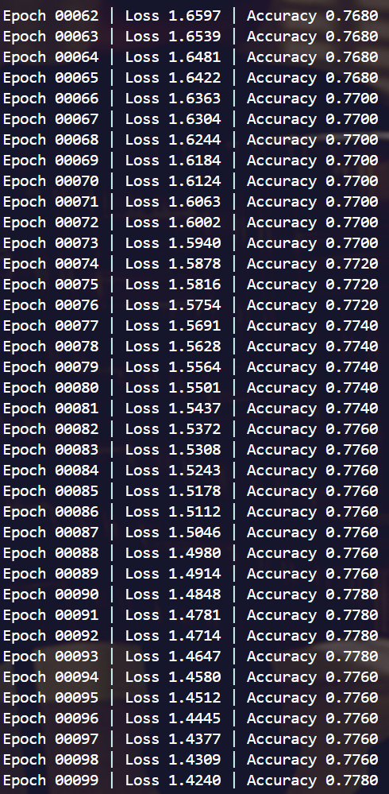

## 这是LLM-As-an-Evaluator-For-Text-attributed-Graph-Node-Classification的实验仓库

**实验参考：**
https://datawhalechina.github.io/grape-book/#/docs/01%E4%BB%8B%E7%BB%8D/01%E4%BB%8B%E7%BB%8D

* GraphSAGE.py 实验结果：

* R-GCN.py 实验结果：

* GAT.py 实验结果：

> 结果可视化：我们在完成节点分类任务之后，通过对 GAT 模型的训练，我们可以通过 GAT 来提取每个节点的原始特征通过 GAT 映射到新的向量空间，我们这里将所有的节点的新的向量表征拿出来，然后通过 t-SNE 降维来进行可视化。其结果如下，可以看出，相同标签的样本具有一定的集中性，这说明 GAT 确实可以将 Cora 的数据进行较为不错的拟合。

* HAN.py 同质图实验结果：

* HAN.py 异质图实验结果：

